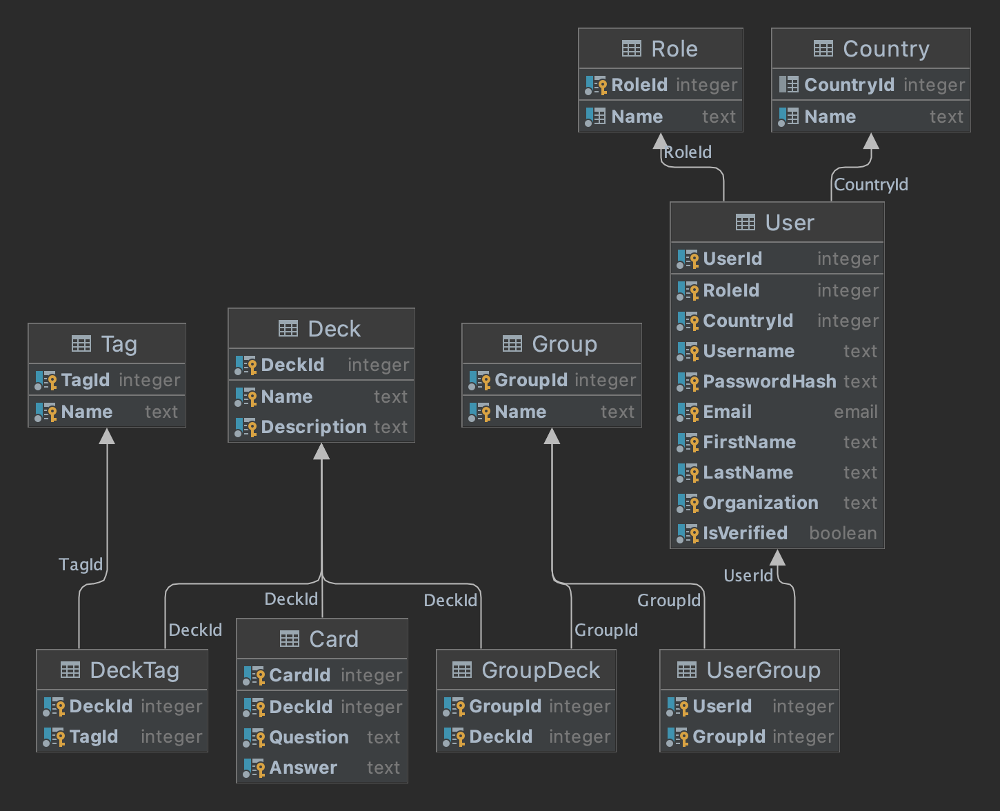

# Database organization

## Files:

1. **db.config** - postgres user and database configuration.

2. **install.sh** - bash script that creates and populates this database.

3. **uninstall.sh** - bash script that deletes the database.

4. **table-definition.sql** - a file in which we create tables, constraints, indexes and default values.

5. **functions.sql** - a file in which we create functions and procedures.

6. **sample-data.sql** - a file in which we insert data into tables.

7. **testing.sql** - a file in which we test the database.

## Diagram:

